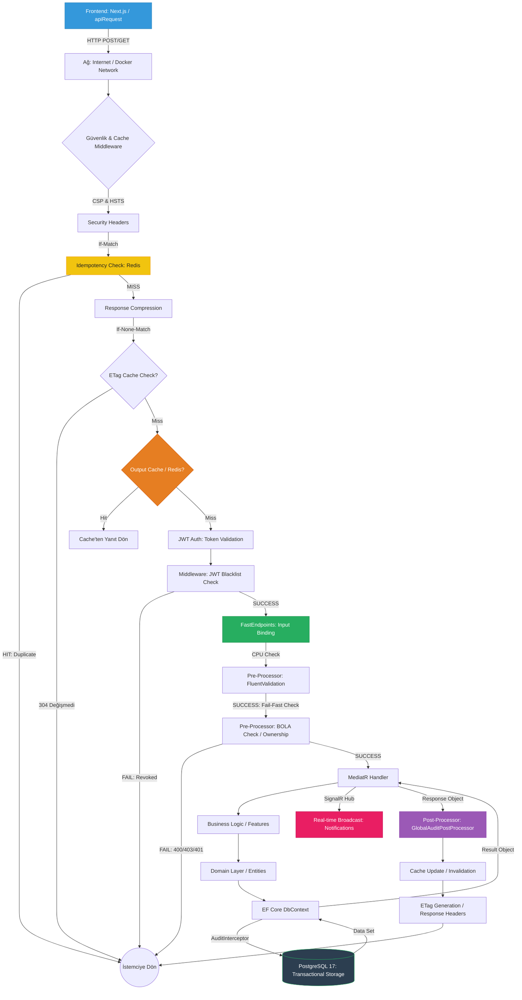

# 🔄 Epiknovel İstek Yaşam Döngüsü (Request Lifecycle)

Bu döküman, bir isteğin (request) kullanıcı tarafındaki Web arayüzünden başlayıp, veritabanına ulaşana kadar geçtiği tüm aşamaları görsel ve adım adım açıklamaktadır.

---

## 📊 İstek Akış Diyagramı (Mermaid)

---

## 🚀 Durak Detayları

### 1. **Frontend (Next.js)**
`apiRequest` fonksiyonu ile istek başlatılır. `credentials: 'include'` ile JWT (veya Cookie) otomatik olarak eklenir.

### 2. **Pipeline (Middleware Layer)**
Sunucuya ulaşan istek ilk olarak performansa ve güvenliğe tabi tutulur:
*   **Response Compression**: Yanıtlar yolda sıkıştırılır.
*   **ETag (Marvin.Cache.Headers)**: "Veri bende zaten var" diyen tarayıcıya (veya Redis'e) sorulur. Veri değişmediyse 304 döner.
*   **Output Cache (Redis)**: Eğer tam bu isteğin yanıtı Redis'te varsa, hiç koda girmeden yanıt dönülür.

### 3. **Authentication & Rate Limiting**
*   **JWT Validation**: Token'ın süresi, imzası ve blacklist (Redis üzerinden) durumu kontrol edilir.
*   **Rate Limiter**: Kullanıcının (veya IP'nin) saniyelik/dakikalık limitleri aşmadığı doğrulanır.

### 4. **API Katı (FastEndpoints)**
*   **Routing**: İstek doğru handler ile eşleşir.
*   **Pre-Processors**: 
    - `FluentValidation`: Veri tipi ve iş kuralları doğruluğu.
    - `BOLA (Broken Object Level Authorization)`: Kullanıcının sadece **kendi** verisine erişip erişmediği kontrol edilir (örn: Benim yorumum mu?).

### 5. **Uygulama Katı (MediatR)**
*   **Handler**: İş mantığının (Business Logic) kalbidir. Modüller arası zayıf bağlılık ile çalışır. `Post-Processors` burada denetim (Audit) kuyruğuna veri ekler.

### 6. **Veri Katı (EF Core & PostgreSQL)**
*   **Audit Interceptor**: Veri kaydedilmeden hemen önce `[Masked]` alanları ayıklar ve merkezi log tablosuna neyin değiştiğini `Background Worker` ile asenkron yazar.
*   **PostgreSQL 17**: Veri kalıcı olarak saklanır.

---

## ⚡ Neden Bu Kadar Çok Durak Var?
Bu yapılandırma, uygulamanın **Ölçeklenebilirlik (Scalability)** ve **Güvenlik (Security)** açısından sarsılmaz olmasını sağlar. Çok katmanlı önbellekleme (Caching) sayesinde veritabanı trafiği minimize edilirken, BOLA ve Rate Limiters gibi bileşenler sistemi kötü niyetli saldırılara karşı korur.
